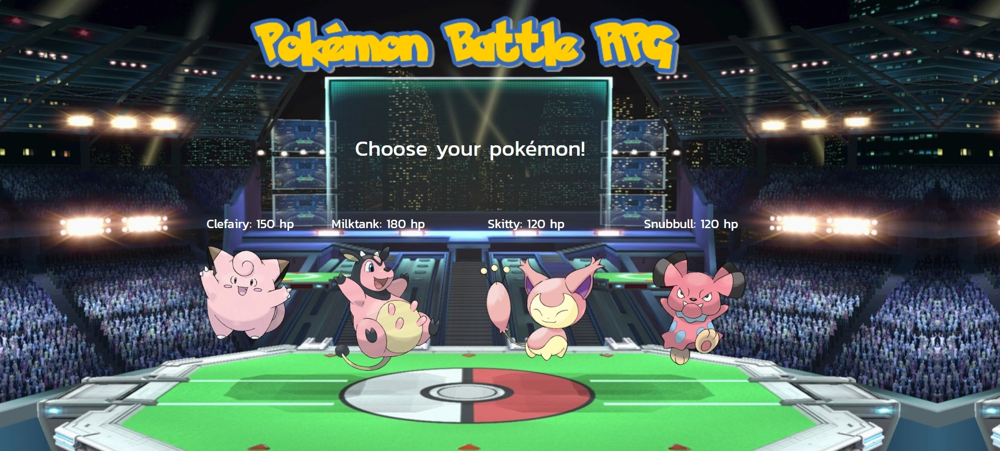

# Pokemon-Battle

This is unfinished work in progess.

This is a short, simple Pokemon game where the user must pick one Pokemon as their fighting character.
The selected Pokemon must then defeat the other three through a series of matches without breaks.
For every attack your pokemon makes, the opposing pokemon will counter.
However, your pokemon's attack will increase in strength with every attack. Your opponent's counter attacks will stay static.

I made a conscious decision to make all the pokemon normal types as to not confuse traditionalist pokemon players.
There is no type advantage in this game.
